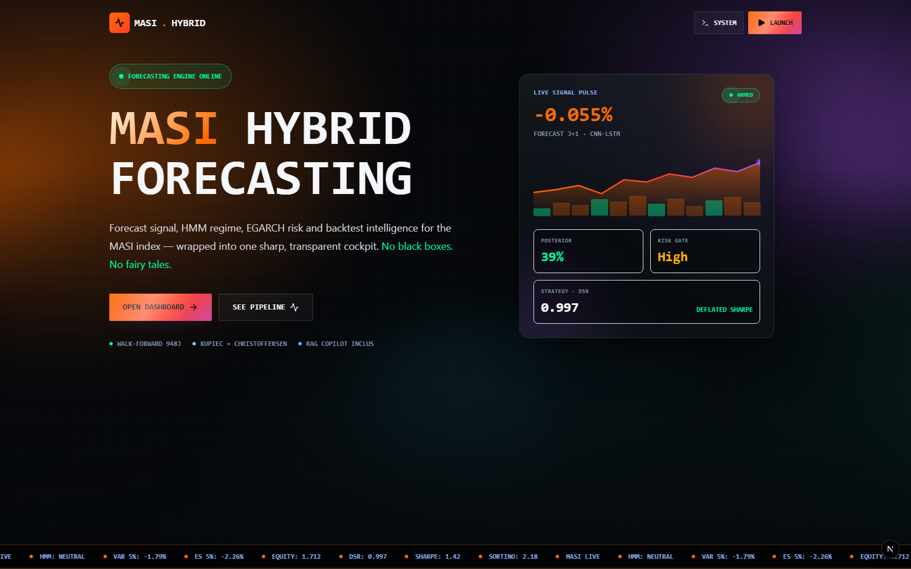
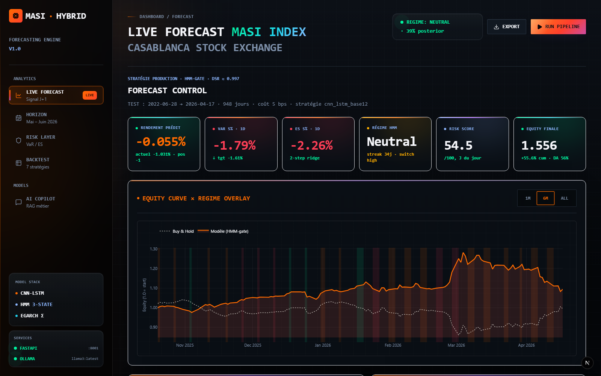
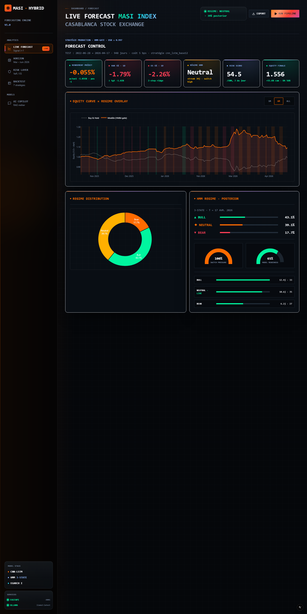
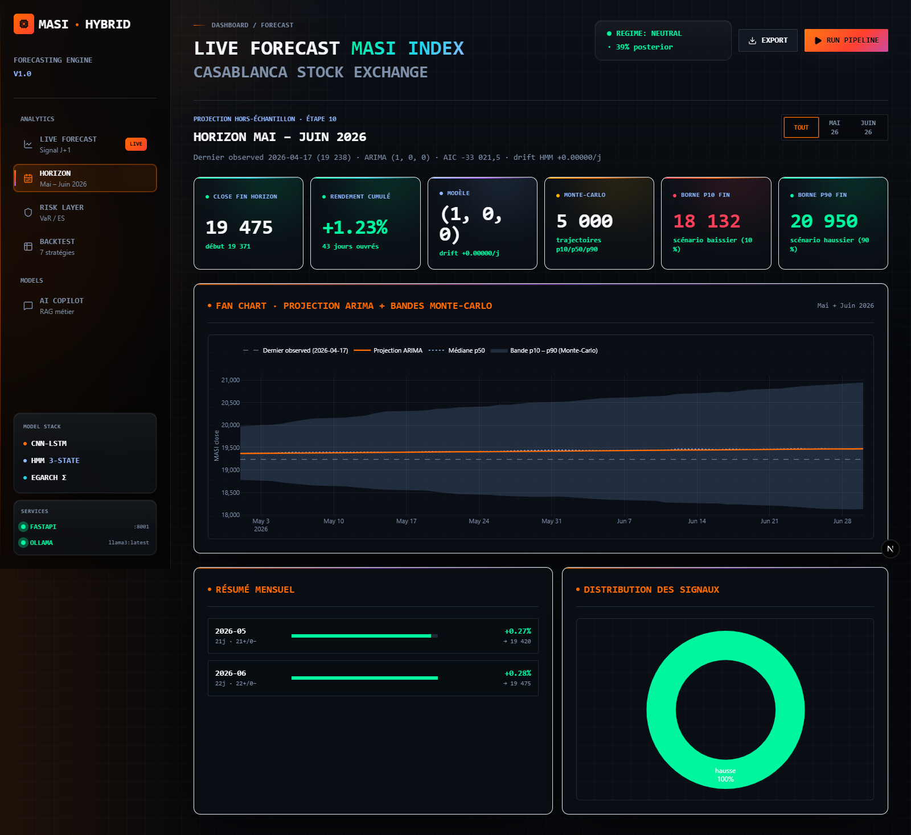
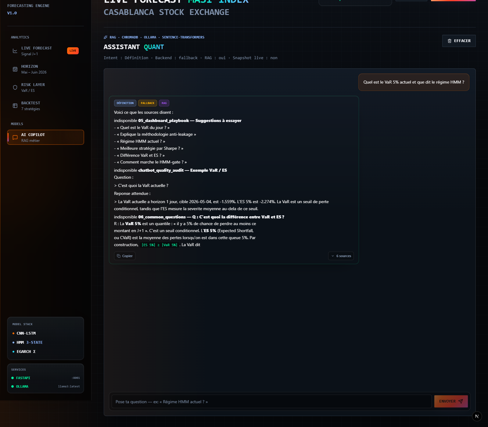

<div align="center">

# MASI Hybrid Forecasting — Dashboard

**Dashboard FastAPI + Next.js + assistant RAG local par-dessus le moteur de recherche `masi-hybrid-forecasting`.**

[](https://www.python.org/)
[](https://fastapi.tiangolo.com/)
[](https://nextjs.org/)
[](https://ollama.com/)
[](https://dashbord-masi-hybrid-forecasting-01.readthedocs.io/)
[](#licence)

</div>

> **Aucune duplication du pipeline** : le dashboard lit directement les
> artefacts canoniques produits par la CLI
> `python -m masi_hybrid_forecasting.pipeline`. Modèles HMM, CNN-LSTM et GARCH
> sont entraînés en amont par le moteur, le dashboard est strictement en
> lecture seule.



---

## Table des matières

- [Aperçu](#aperçu)
- [Captures d'écran](#captures-décran)
- [Architecture](#architecture)
- [Assistant RAG (vue détaillée)](#assistant-rag-vue-détaillée)
- [Pré-requis](#pré-requis)
- [Installation](#installation)
- [Lancement](#lancement)
- [Structure du projet](#structure-du-projet)
- [Endpoints API](#endpoints-api)
- [Configuration LLM](#configuration-llm)
- [Principes de design (frontend)](#principes-de-design-frontend)
- [Tests rapides](#tests-rapides)
- [Documentation complète](#documentation-complète)
- [Licence](#licence)

---

## Aperçu

| Module | Description |
|---|---|
| **Forecast** | Prédiction J+1 (CNN-LSTM × HMM-gate), KPI live, courbe d'équité vs Buy & Hold, distribution & persistance des régimes, risk score 0-100. |
| **Risk** | Séries VaR / ES / vol GARCH, breaches observés vs attendus, tests Kupiec & Christoffersen. |
| **Backtest** | 7 stratégies comparées (Sharpe / Sortino / Drawdown / equity), courbes d'équité multi-stratégies. |
| **Assistant (RAG)** | Chatbot indexant `docs/`, `reports/`, `outputs/etape*/report.md` et les 9 notebooks Jupyter. Intent routing, guardrails anti-hallucination, fallback déterministe (zéro appel réseau si pas de LLM configuré). |

---

## Captures d'écran

### Dashboard — Vue d'ensemble

Top du dashboard : KPI live, prédiction J+1 et statut des régimes HMM.



### Dashboard — Vue complète

Vue intégrale (forecast, risk, backtest, persistance des régimes) sur une même page.



### Forecast — Horizon J+1

Détail de la prédiction CNN-LSTM × HMM-gate et de la courbe d'équité comparée à
Buy & Hold.



### AI Copilot — Assistant RAG

Chatbot avec intent routing, citations de sources et fallback déterministe.



---

## Architecture

```text
┌───────────────────────────────┐         ┌─────────────────────────────┐
│  masi-hybrid-forecasting      │         │  dashbord-masi-hybrid-...   │
│  (moteur de recherche)        │         │  (ce dépôt)                 │
│                               │         │                             │
│  Pipeline CLI                 │ ─CSV/   │  FastAPI  ─►  Next.js UI    │
│  (HMM + CNN-LSTM + backtest)  │   JSON─►│     │                       │
│                               │         │     └──►  RAG assistant     │
│  → outputs/etape*/            │         │           (Chroma + BM25)   │
│  → reports/                   │         │                             │
└───────────────────────────────┘         └─────────────────────────────┘
        artefacts canoniques                  lecture seule des artefacts
```

Voir [`PROJECT_OVERVIEW.md`](PROJECT_OVERVIEW.md) pour la vision globale du
système (moteur + dashboard).

---

## Assistant RAG (vue détaillée)

L'assistant **RAG (Retrieval-Augmented Generation)** est un chatbot
spécialisé qui répond aux questions sur la prévision J+1, le risque
(VaR/ES), les régimes HMM, les stratégies de backtest et la méthodologie.
**Tout tourne localement** par défaut, via Ollama.

### Pipeline complet

```text
question → validate → intent → response_policy → routed_context
        → prompt_builder → LLM (Ollama) ──┐
                              │           │
                              └─► fallback déterministe (si LLM down)
                              │
        → answer_repair → response_guardrails → réponse + sources + meta
```

Orchestrateur : [`rag_project/chatbot/service.py`](rag_project/chatbot/service.py)
— le module `app/chatbot/service.py` n'est qu'une **façade mince** qui ajoute
le snapshot live (forecast/risk/regime) avant de déléguer.

### Les 8 intents

L'intent router (`rag_project/chatbot/intent_router.py`) utilise
**sentence-transformers** pour comparer la question à des centroïdes
pré-calculés. Si la similarité cosine est < `RAG_INTENT_THRESHOLD` (défaut
0.30), bascule sur un matcher lexical.

| Intent | Exemples | Contexte utilisé |
|---|---|---|
| `forecast_query` | « la prédiction du jour ? » | snapshot live + chunks forecast |
| `risk_query` | « le VaR aujourd'hui ? » | snapshot live + chunks risk |
| `regime_query` | « quel régime HMM ? » | snapshot live + chunks HMM |
| `strategy_query` | « meilleur Sharpe ? » | metrics backtest + chunks |
| `methodology` | « comment marche le CNN-LSTM ? » | chunks docs + notebooks |
| `glossary` | « c'est quoi la VaR ? » | doc curated `03_glossary.md` |
| `help_request` | « que peux-tu faire ? » | playbook |
| `out_of_scope` | « météo à Casablanca ? » | refus + redirection |

### Retrieval hybride : Chroma + BM25

| Signal | Détail |
|---|---|
| **Chroma (cosine)** | embeddings via `sentence-transformers/all-MiniLM-L6-v2`, persistance dans `.chroma_db/`, top-K=6 |
| **BM25 (lexical)** | index in-memory via `rank-bm25`, capture les acronymes techniques (VaR, ES, HMM…) |
| **Fusion** | `score_final = (1 - α) * score_cosine + α * score_bm25` avec `α = RAG_BM25_WEIGHT` (défaut 0.4) |

### Sources indexées

`python -m rag_project.scripts.build_index` indexe :

1. **8 docs curated** (`rag_project/docs/*.md`) — toujours en priorité haute :
   `01_overview`, `02_methodology`, `03_glossary`, `04_limitations`,
   `05_dashboard_playbook`, `06_common_questions`, `07_operating_contract`,
   `08_interpretation_rules`.
2. **Tous les `.md`** de `masi-hybrid-forecasting/docs/` et `reports/`.
3. **Les `report.md`** de chaque `outputs/etape*/`.
4. **Les 9 notebooks Jupyter** (`notebooks/*.ipynb`) — cellules markdown +
   code + outputs textes courts.

Chunk size : ~600 caractères avec chevauchement, optimisé pour les
fenêtres de contexte 4k tokens.

### Guardrails

Les `response_guardrails` analysent la réponse générée **avant** de la
renvoyer à l'utilisateur :

**Refus systématique :**
- Recommandation d'achat / vente → refus standard, badge `policy`
- Conseil d'investissement personnalisé → refus poli
- Prédiction sur autre actif que MASI → refus hors-scope

**Corrections automatiques (`answer_repair`) :**
- Pourcentage halluciné absent du contexte → retiré
- Confusion VaR / ES → reformulé selon le glossaire
- « régime HMM prédit la direction » → corrigé (HMM = régime, pas direction)
- « Monte Carlo pour horizon 10/25j » → corrigé (pas la méthodo réelle)
- « MASI = marché algérien » → corrigé (MASI = Casablanca, Maroc)
- Dates relatives inventées (« aujourd'hui ») → flag

### Tester sans démarrer l'API

```powershell
# Single shot
python -m rag_project.scripts.test_chat "c'est quoi la VaR ?"

# Batch de 9 questions samples
python -m rag_project.scripts.test_chat
```

### Variables d'environnement RAG

| Variable | Défaut | Rôle |
|---|---|---|
| `MASI_PROJECT_ROOT` | `…/masi-hybrid-forecasting` | Racine MASI à indexer |
| `LLM_BACKEND` | `ollama` | `ollama` \| `openai` \| `anthropic` \| `fallback` |
| `OLLAMA_MODEL` | `qwen2.5:3b` | Modèle Ollama |
| `OLLAMA_BASE_URL` | `http://localhost:11434` | URL Ollama |
| `OLLAMA_AUTO_START` | `1` | Démarre `ollama serve` auto si down |
| `OLLAMA_TEMPERATURE` | `0.15` | Température (faible = déterministe) |
| `OLLAMA_NUM_CTX` | `4096` | Context window |
| `OLLAMA_NUM_PREDICT` | `700` | Max tokens générés |
| `RAG_CHROMA_DIR` | `./.chroma_db` | Persistance Chroma |
| `RAG_COLLECTION` | `masi_kb` | Nom de la collection |
| `RAG_TOP_K` | `6` | Nombre de chunks retournés |
| `RAG_BM25_WEIGHT` | `0.4` | Poids BM25 dans le score combiné |
| `RAG_EMBEDDING_MODEL` | `all-MiniLM-L6-v2` | Modèle SBERT |
| `RAG_EMBEDDING_DEVICE` | `cpu` | `cpu` \| `cuda` |
| `RAG_INTENT_THRESHOLD` | `0.30` | Seuil cosine → out_of_scope |

> :books: Voir la **[doc RAG complète sur Read the Docs](https://dashbord-masi-hybrid-forecasting-01.readthedocs.io/fr/latest/rag/)** pour les diagrammes, le dépannage détaillé et les exemples avancés.

---

## Pré-requis

- **Python 3.10+**
- **Node.js 18+** (pour le frontend Next.js)
- Le projet `masi-hybrid-forecasting` cloné et son pipeline déjà exécuté au moins
  une fois pour produire les artefacts :
  - `outputs/etape6/etape6_final_predictions.csv`
  - `outputs/etape7/risk_metrics_test.csv`
  - `outputs/etape8/strategies_metrics.json`

---

## Installation

```powershell
# Depuis la racine de ce dossier
python -m venv .venv
.\.venv\Scripts\Activate.ps1
pip install -U pip
pip install -r requirements.txt

# Copie le template d'environnement et ajuste MASI_PROJECT_ROOT
Copy-Item .env.example .env
# Ouvre .env et ajuste les chemins si besoin
```

### Construction de l'index RAG (1ère fois)

```powershell
python -m app.rag.build_index
# ou
python scripts/build_rag_index.py
# ou
python -m rag_project.scripts.build_index
```

> :book: Guide d'installation **détaillé** (avec Ollama, modèles
> recommandés, dépannage complet) → [`INSTALL.md`](INSTALL.md)

---

## Lancement

```powershell
# Terminal 1 : API FastAPI
.\scripts\run_dev.ps1
# ou directement :
python -m uvicorn app.main:app --host 127.0.0.1 --port 8000 --reload

# Terminal 2 : UI Next.js
cd frontend
npm install
npm run dev
```

Puis ouvre :

- **Dashboard Next.js** : <http://127.0.0.1:3000/>
- **API docs (OpenAPI)** : <http://127.0.0.1:8000/docs>

---

## Structure du projet

```text
dashbord-masi-hybrid-forecasting-01/
├── app/                         # Backend FastAPI
│   ├── main.py                  # entrée FastAPI
│   ├── core/                    # config, paths
│   ├── api/routes/              # /api/forecast, /api/risk, /api/backtest,
│   │                            #   /api/predictions, /api/chat, /api/health
│   ├── services/                # data_loader (lecture artefacts MASI),
│   │                            #   forecast / backtest / risk / prediction
│   ├── rag/                     # build_index, retriever (Chroma + BM25 rerank),
│   │                            #   intent_router, docs
│   ├── chatbot/                 # service, fallback, guardrails, llm_client
│   │                            #   (OpenAI / Anthropic / Ollama)
│   └── schemas/                 # Pydantic
├── frontend/                    # Frontend Next.js
│   ├── app/                     # App Router Next.js
│   ├── src/                     # composants React, API client, formatters
│   ├── package.json             # scripts Next.js
│   └── index.html               # ancienne SPA statique conservée comme référence
├── rag_project/                 # Pipeline RAG autonome (engine complet)
│   ├── core/                    # config, paths
│   ├── rag/                     # retriever, build_index, notebook_parser
│   ├── llm/                     # ollama_client
│   ├── chatbot/                 # intent_router, policy, guardrails, service
│   └── docs/                    # 8 docs curated indexés en priorité
├── scripts/                     # run_dev (ps1/sh), build_rag_index
├── docs/
│   ├── index.md                 # documentation Read the Docs
│   ├── architecture.md
│   ├── installation.md
│   ├── rag.md
│   ├── api.md
│   ├── screenshots.md
│   └── screenshots/             # captures d'écran utilisées partout
├── requirements.txt
├── pyproject.toml
├── mkdocs.yml                   # config Read the Docs
├── .readthedocs.yaml            # config Read the Docs
├── INSTALL.md                   # guide d'installation détaillé
├── PROJECT_OVERVIEW.md          # vue système (moteur + dashboard)
└── .env.example
```

---

## Endpoints API

| Méthode | Route                                   | Description                              |
|---------|-----------------------------------------|------------------------------------------|
| GET     | `/api/health`                           | statut + presence artefacts              |
| GET     | `/api/forecast/latest`                  | prédiction J+1 + métriques live          |
| GET     | `/api/forecast/series?window=`          | série historique                         |
| GET     | `/api/forecast/kpis`                    | KPI agrégés                              |
| GET     | `/api/forecast/regimes`                 | distribution HMM                         |
| GET     | `/api/risk/series?window=`              | VaR / ES / vol par jour                  |
| GET     | `/api/risk/validation`                  | Kupiec / Christoffersen                  |
| GET     | `/api/risk/breaches`                    | comptage breaches                        |
| GET     | `/api/strategies`                       | toutes stratégies + métriques            |
| GET     | `/api/strategies/{id}`                  | détail d'une stratégie                   |
| GET     | `/api/backtest/equity`                  | courbes d'équité multi-stratégies        |
| GET     | `/api/backtest/summary`                 | résumé étape 6                           |
| GET     | `/api/predictions/snapshot`             | snapshot risk score + persistance régime |
| GET     | `/api/predictions/risk-score`           | série du risk score 0-100                |
| GET     | `/api/predictions/regime-persistence`   | persistance moyenne par régime           |
| POST    | `/api/chat`                             | chatbot RAG                              |

---

## Configuration LLM

Quatre backends supportés (variable `LLM_BACKEND`) :

| Backend     | Réseau ?       | Setup                                   |
|-------------|----------------|-----------------------------------------|
| `fallback`  | aucun          | défaut — réponses déterministes         |
| `ollama`    | local Ollama   | `ollama serve` + `OLLAMA_MODEL`         |
| `openai`    | API OpenAI     | `OPENAI_API_KEY` + `OPENAI_MODEL`       |
| `anthropic` | API Anthropic  | `ANTHROPIC_API_KEY` + `ANTHROPIC_MODEL` |

Si l'appel LLM échoue, le chatbot retombe automatiquement sur le mode `fallback`.

### Modèles Ollama recommandés

| Modèle | Taille | RAM | Profil |
|---|---|---|---|
| `qwen2.5:1.5b` | ~1 Go | 4 Go | machine modeste |
| `qwen2.5:3b` | ~2 Go | 8 Go | défaut léger |
| `llama3.2:latest` | ~2 Go | 8 Go | bon compromis |
| `llama3:latest` | ~5 Go | 16 Go | défaut, qualité |

---

## Principes de design (frontend)

Le frontend Next.js applique des principes de polish via des composants
React/Tailwind :

- shell "MASI control desk" avec navigation React, KPI typés et panels métier ;
- charts Plotly chargés côté client pour éviter le SSR sur `window` ;
- proxy Next `/api/:path*` vers FastAPI via `API_PROXY_TARGET` ;
- animations courtes, `active:scale`, transitions explicites et layout mobile
  vérifié.

---

## Tests rapides

```powershell
# 1. Vérifier que les artefacts MASI sont là
curl http://127.0.0.1:8000/api/health

# 2. Récupérer la dernière prédiction
curl http://127.0.0.1:8000/api/forecast/latest

# 3. Tester le chat
curl -X POST http://127.0.0.1:8000/api/chat `
  -H "Content-Type: application/json" `
  -d '{"message":"quel est le VaR du jour ?"}'
```

---

## Documentation complète

| Doc | Où ? |
|---|---|
| **Site Read the Docs** | <https://dashbord-masi-hybrid-forecasting-01.readthedocs.io/> |
| Guide d'installation pas-à-pas | [`INSTALL.md`](INSTALL.md) |
| Vue système engine + dashboard | [`PROJECT_OVERVIEW.md`](PROJECT_OVERVIEW.md) |
| Pipeline RAG (engine complet) | [`rag_project/README.md`](rag_project/README.md) |
| Frontend Next.js | [`frontend/README.md`](frontend/README.md) |

---

## Licence

Ce dashboard est dérivé du travail de recherche `masi-hybrid-forecasting`. Voir
le projet parent pour les conditions d'utilisation.

> ⚠️ Projet de recherche sur un marché frontière. Rien ici n'est un conseil
> d'investissement. L'assistant est explicitement conçu pour **refuser les
> recommandations d'achat / vente**.
